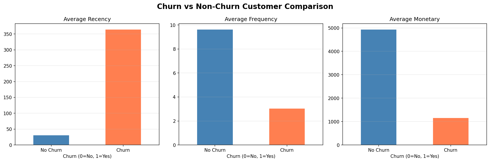
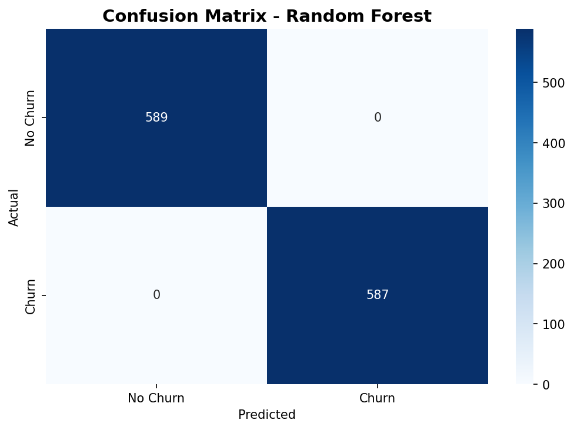
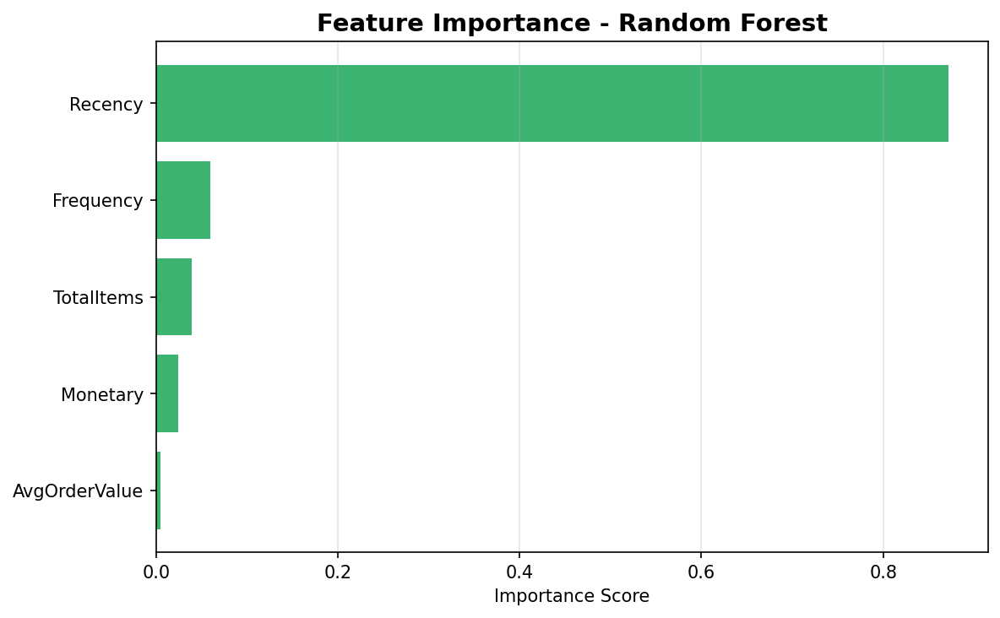

# Customer Churn Prediction

## Project Overview
This project predicts customer churn using machine learning models (Logistic Regression and Random Forest)
on an e-commerce dataset. Customers who have not made a purchase in the last 90 days are labeled as churned.

## Notebook
[Open in Google Colab](https://colab.research.google.com/drive/1M7truDhiRPMeTH4R6gS_QSTEXI5SGdSf?usp=sharing)

## Dataset
- **Source:** [Online Retail II Dataset - UCI / Kaggle](https://www.kaggle.com/datasets/lakshmi25npathi/online-retail-dataset)
- **Size:** 1,067,371 transactions
- **Period:** December 2009 - December 2011

## Methodology
1. **Data Cleaning** - Removed cancelled orders, null Customer IDs, and negative values
2. **Churn Labeling** - Customers with no purchase in last 90 days labeled as churned
3. **Feature Engineering** - Recency, Frequency, Monetary, Average Order Value, Total Items
4. **Modeling** - Logistic Regression and Random Forest Classifier
5. **Evaluation** - Accuracy, Classification Report, Confusion Matrix

## Results
| Model | Accuracy |
|---|---|
| Logistic Regression | See notebook |
| Random Forest | See notebook |

## Visualizations

## Technologies Used
- **Python** - pandas, numpy, matplotlib, seaborn, scikit-learn
- **Google Colab** - Development environment
- **GitHub** - Version control

## Author
hilalinie | Industrial Engineering Student | Data Science Enthusiast
